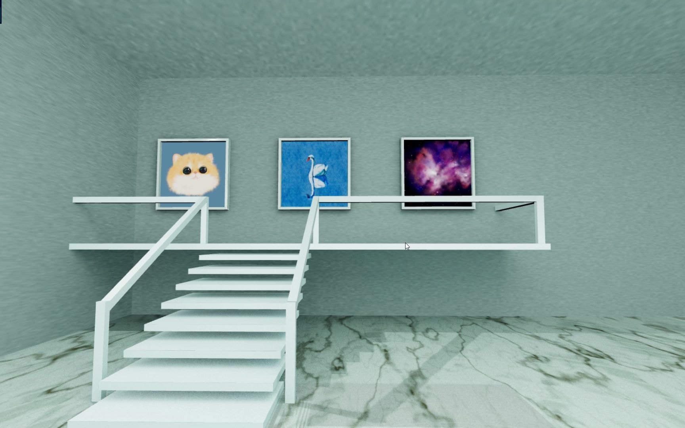

# gallery（数字展馆）



## 介绍
本项目中使用的技术栈为`three.js`，使用`blender`进行建模，最后烘焙渲染场景贴图，导出`glb`地图格式在Web端渲染。  
此项目仅为数字展馆概念的demo项目，如有不完善的地方还请多多包涵，有任何问题都可以提issue。

## 如何操作?
行走：`W`/`S`/`A`/`D`

移动端行走操作: `虚拟摇杆`

跳跃：`空格`

控制视角：`鼠标左键拖动`

## 目录结构说明
```text
├── src                        # 源代码
│   ├── assets                 # 资源文件夹（音频、贴图、模型）
│   │── audio                  # 音频类（创建位置音频）
|   │── character              # 人物角色类（人物模型控制）
|   │── controlManage          # 键盘控制类（键盘按键或虚拟摇杆状态管理）
|   │── core                   # 核心基础类（包括camera、renderer、scene等）
|   │── css3DRenderer          # 负责DOM元素与WebGL的内容相结合（渲染电脑屏幕的iframe元素）
|   │── environment            # 场景类（创建地图模型、画展贴图、地面镜面反射）
|   │── lib                    # three.js相关扩展库
|   │── loader                 # 加载器类（glb、texture、audio等加载器管理）
|   │── rayCasterControls      # 射线投射类（角色与画框交互触发检测）
|   │── ui                     # UI类（负责控制渲染页面的部分UI，例如加载进度页，详情窗口，虚拟摇杆）
|   │── utils                  # 工具函数
|   |    │── Emitter.ts        # 事件分发类（各类事件的分发）
|   |    └── typeAssert.ts     # 类型推导工具函数
|   │── world          # 游戏核心类（用于管理游戏世界中的核心元素，包括环境、角色、交互探测和音频等组件）
|   │── main.ts        # 页面入口函数
|   └── Constants.ts   # 常量定义（定义模型/贴图/媒体资源地址、分发事件名等）
```

## 对于此开源项目的个人想法： 
受threejs官网demo项目的灵感，在开发此项目时尝试了很多方案，也看到有很多类似的项目，但大多这类型的项目都是明码标价售卖的（格局太小了），反观老外的github上，有大量优秀的3D开源项目，这也正是别人技术发展如此迅速的原因。
因此本人还是觉得不要吝啬于贡献技术，多多开源项目，给到更多人灵感，相互提供帮助才能更好地推动行业发展。

> 开源不易，多多Star⭐⭐⭐  

## 捐赠
开源不易，你的支持，就是我的源源不断的动力！本项目为开源项目，捐赠均为自愿。
### 如何捐赠？
[爱发电⚡](https://afdian.net/a/twimark)

## 🎇feature：  
1. 高性能碰撞检测：  
因为这类项目对于物理引擎的应用场景并不多，经过不懈的技术方案调研后使用了一套不依赖于物理引擎的高性能的动态碰撞检测方案。比`three.js`官网的`Octree`方案性能还要好上几倍。
2. 画展交互：  
利用光线投射进行物体探测触发互动效果。
3. 位置音频：  
加入了位置音频，模拟现实中的听觉传播，使得场景中的音乐更具有空间感，提升浏览体验。

## 运行
To setup a dev environment:
```text
# Clone the repository

# Install dependencies
npm i

# Run the local dev server
npm run dev
```
To serve a production build:
```text
# Install dependencies if not already done - 'npi i'

# Build for production
npm run build
```
